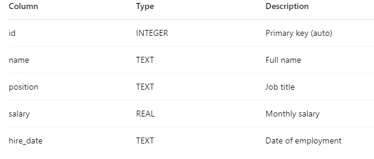
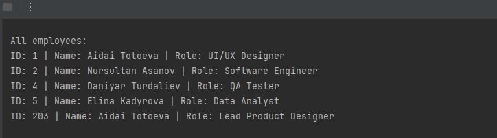
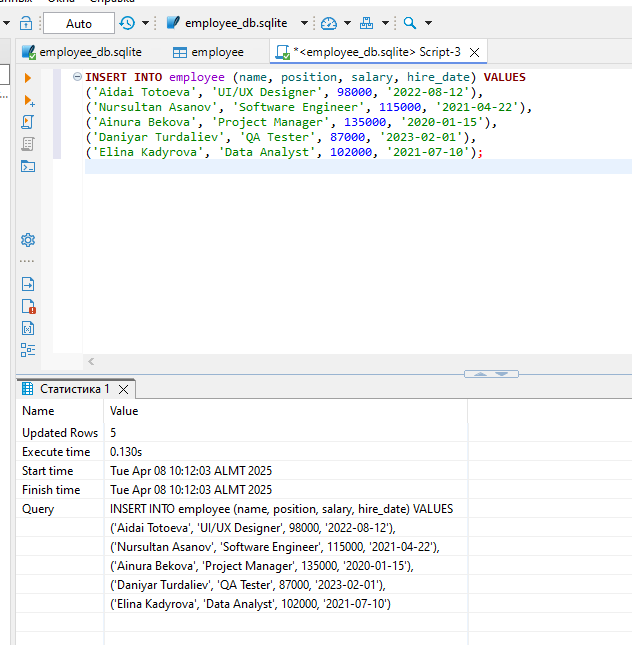

# Employee Management System (SQLite + Python)

This project is a simple **Employee Management System** developed using **Python** and **SQLite**.  
It allows you to perform CRUD operations (Create, Read, Update, Delete) on an employee database.

---

## 📁 Project Structure

- `entity_person.py` — defines the `Person` class (employee structure).
- `employee_dao.py` — defines `PersonDatabase` class for all database operations.
- `main.py` — test script for checking insert, update, read, and delete operations.
- `employee_db.sqlite` — SQLite database file.
- `screenshots/` — folder with screenshots of database table and program output.
- `README.md` — project documentation.

---

## 💻 How to Run

1. Make sure you have **Python 3.7+** installed.
2. Make sure the file `employee_db.sqlite` exists and contains the `employee` table.
3. Run the script using:

```bash
python main.py
```
🧱 Employee Table Structure (SQLite)


📸 Screenshots


img_1.png](img_1.png)

📌 Example Input/Output

```bash
aidai = Person(203, "Aidai Totoeva", "UI/UX Designer", 98000, "2022-08-12")
db.insert_employee(aidai)

db.fetch_all()

aidai.role = "Lead Product Designer"
db.update_employee(aidai)

db.delete_employee(203)
```


👩‍💻 Author
Aidai Totoeva
